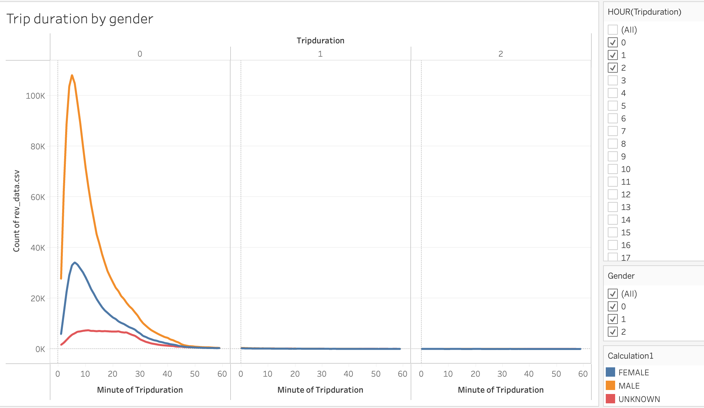

# **Tableau Challenge**

## **Overview:**

The goal of this project is to gather insights from the bike share data from NY city to establish a bike share business. The analysis attempted to determine the following:

1. The tripduration of bikers
2. Gender bias in biking preference
3. The time of the day and week when biking is preferred.
4. Differnce between subscribers vs non-subscribers
5. Preferred bike parking areas
6. Maintenance schedule

## **Most rides are shore rides:**

Majority of the rides seem to be of shorter duration that last anywhere from 5-20 minutes. Though there are people who prefer to rent the bikes as long as 24 hours, there is a sharp decline in the number of rides after an hour.

## **Men prefer riding bikes more than women:**

Men seem to prefer riding bikes more than women. Based on the graph, about 108,000 men and about 34,000 women enjoy riding the bikes that are approximately 5 min long.

## **Rush hours are peak biking hours:**

Majority of the bike-riders prefer 7-9AM in the morning and 5-7PM in the evening Monday through Friday. This is interesting as these times coincide with rush hours. Given the high traffic during rush hours, it is highly likely that several people prefer riding the bikes than using their automobiles. This is an important selling point for a business to promote biking as an alternative and cheap mode of transport for people who commute short distances to work. Over the weekends however, bike riders' time preferences are not particularly restricted to a time frame. This is also indicative that most weekend riders could be tourists and other locals wanting a leisurely drive.

##**Further evidence that men prefer biking more than women:**

This ascertains the previous conclusion that men prefer bike riding more than women. However, there could be instances where a family member may be driving with money paid by another family member. Further analysis should be to determine the reasons why men prefer biking more than women and find ways to promote biking among women.

##**Subscribers vs non-subscribers:**

This graph shows that subscribers use the bike more often than non-subscribers. Subscribers usually pay lower than non-subscribers. This data also points out that most people using the bikes are most probably locals. Therefore, this also points out that non-subscribers who are possibly tourists do not use as much. Promoting bikes through advertisements and signposts may be a good way to get this across to non-subscribers. Monday, Tuesday, Thursday, and Friday are preferred days. It will be interesting to further investigate as to why there is a sharp fall in biking on Wednesday.

##**Preferred bike parking spots:**

Based on the number of bikes parked in certain areas it becomes clear some areas are more preferred than others. The reason for this discrepancy is worth investigating and will be beneficial to plan future locations for parking bikes.

##**Bike maintenance scheduling:**

This graph determines the number of bikes in use on a particular time of the day. Between 1 AM and 4 AM the number bikes in use are very minimal and is the ideal time to perform maintenance operation on bikes without affecting operational efficiency.

